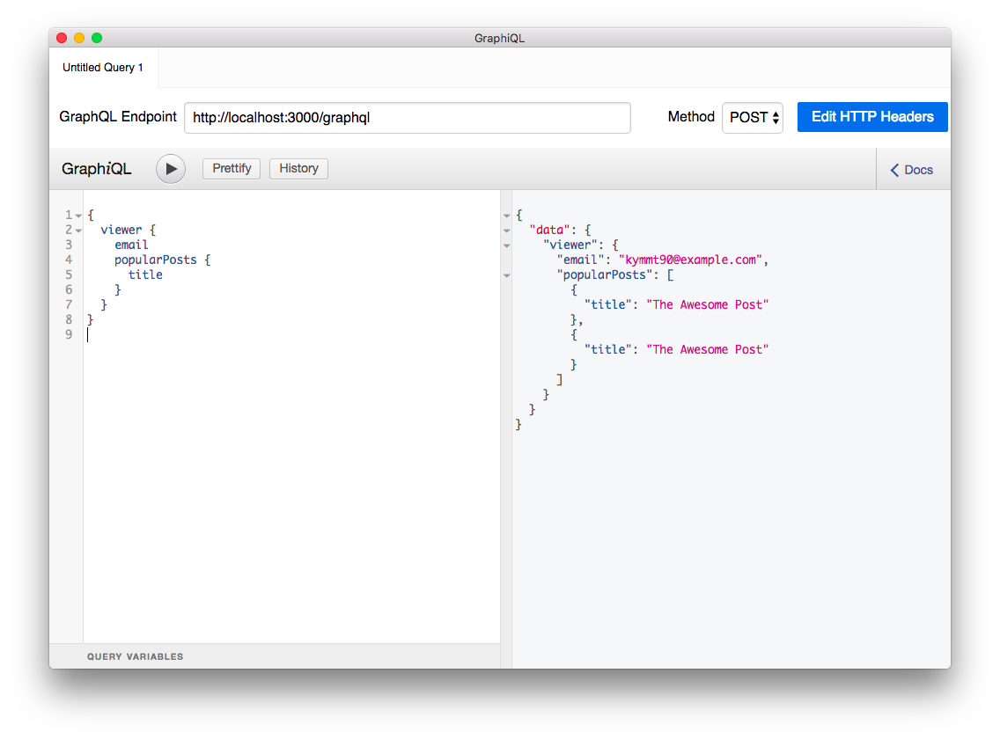

# README

## 準備

Rubyが必要です。

```
$ git clone git@github.com:kymmt90/schema-first-graphql-example.git
$ bundle
```

## GraphQLスキーマの生成

```
$ bin/rails graphql:schema:dump_as_js
$ cat ./mock_app/type_defs.js
module.exports = `
type Mutation {
  # An example field added by the generator
  testField: String!
}

type Post {
  title: String
}

type Query {
  viewer: User
}

type User {
  email: String
  popularPosts: [Post!]
}
`
```

## モックサーバ立ち上げ

Nodeが必要です。

```
$ cd mock_app
$ npm install
$ node index.js
GraphQL mock server is running!!1
```

`localhost:3000` でサーバが動きます。


